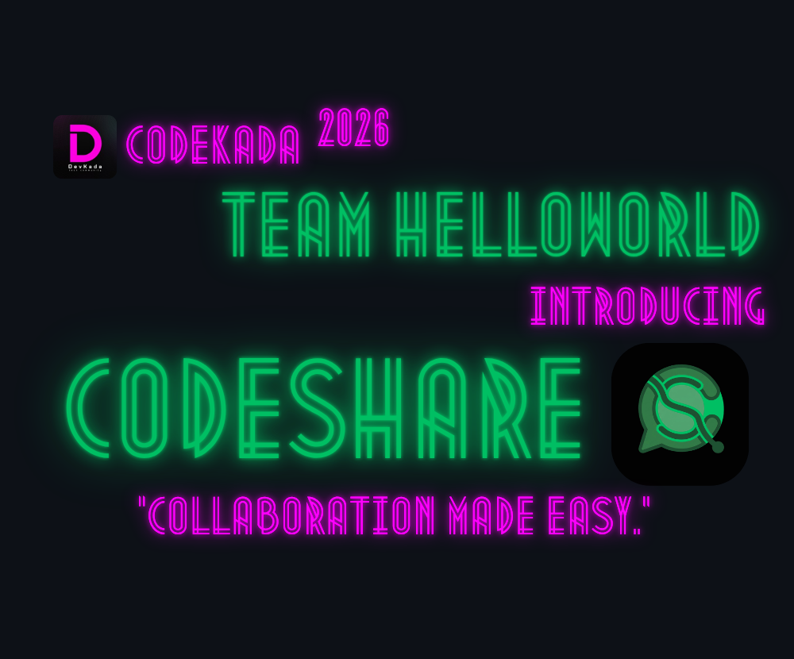
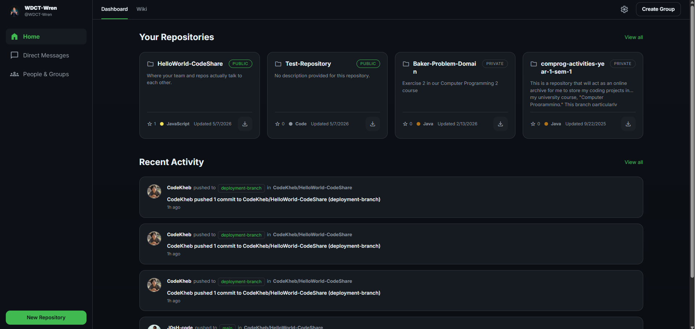
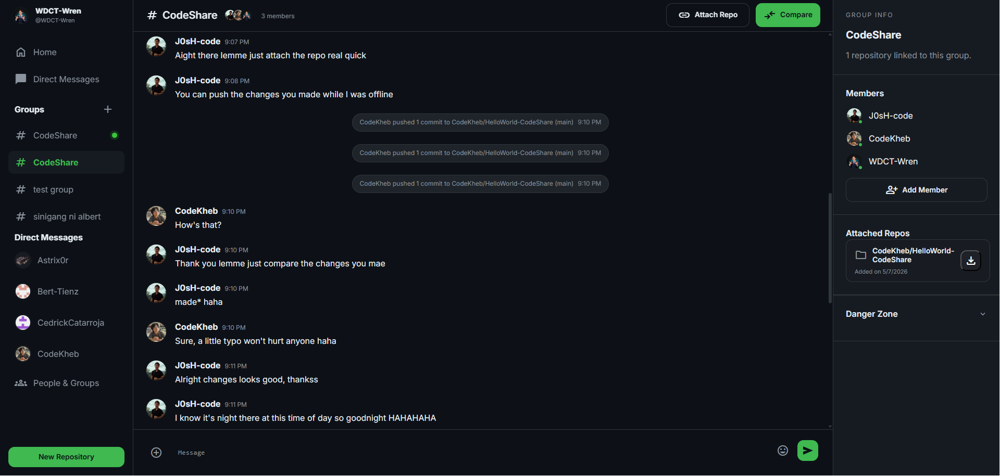
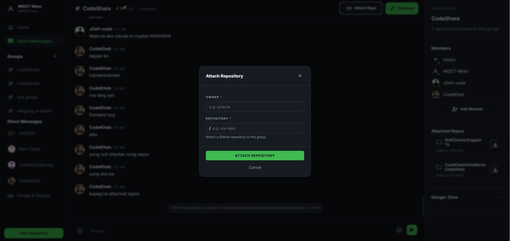
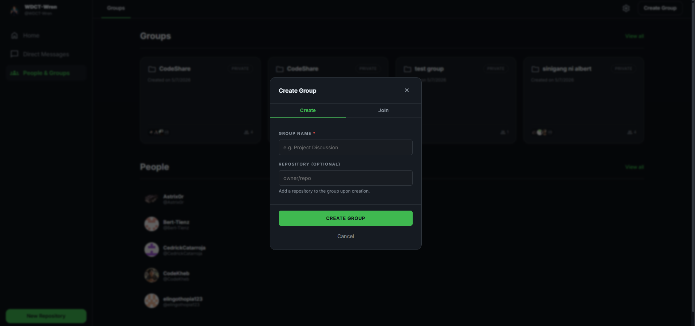
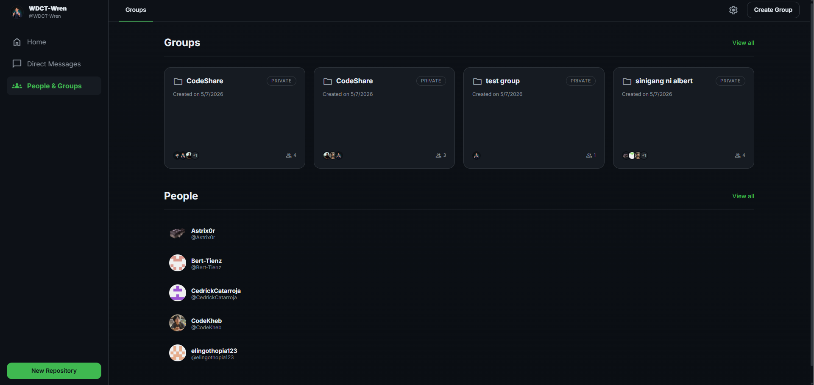
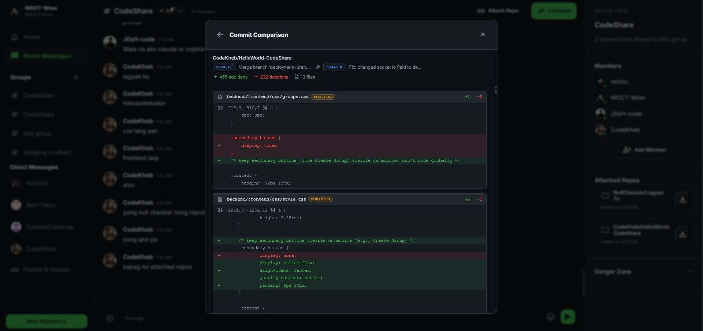

# CodeShare

	

**Collaboration made easy.**

CodeShare is a real-time collaboration platform that brings GitHub directly into your team chat. Stop bouncing between Discord, Slack, and GitHub. Stop losing context. Developer teams working remotely deserve tools built for distributed work—and CodeShare is that tool.

## 🎯 Try It Now
**[CodeShare Live Demo](https://helloworld-codeshare.onrender.com)**

### 🎬 Watch It in Action

*2-minute walkthrough showing GitHub integration, real-time chat, Commit Comparisons*

---

## The Problem

Distributed developer teams live in a constant context switch:
- Repository activity happens on GitHub
- Communication happens in Slack or Discord  
- Pull request discussions scatter across two platforms
- Someone asks "what happened in the repo?" and nobody knows without checking

**There's a better way.**

---

## What CodeShare Does

CodeShare unifies real-time team chat with live GitHub integration. Attach a repository to a group chat, and every push, pull request, and release instantly surfaces as a system message right where your team is already talking. No notifications to miss. No context to lose. One conversation. Everything you need.

---

## ✨ Core Features

### 💬 **Real-Time Group Chat**
Instant messaging with message persistence. Built on Socket.io for ultra-responsive conversations.

### 🔐 **GitHub OAuth Authentication**
One-click login with your GitHub account. No passwords. No friction.

### 🔗 **GitHub Event Integration**
Attach repos to group chats. Push events, PR updates, and releases appear as live system messages. Your entire team stays synchronized in one feed.

### 💭 **Intuitive Commit Comparisons**
See what changed in the codebase with a simple click! View and assess changes while still actively talking to your collaborators.

### 📦 **Repo ZIP Downloads**
Download any attached repository as a ZIP file directly from the chat. No leaving the app.

### 💌 **Direct Messages**
One-on-one conversations between team members for private discussions.

### 📊 **Dashboard**
Central overview of all your groups and cross-repo GitHub activity in one unified feed.

---

## 🛠️ Built With

| Layer | Technology |
|-------|-----------|
| **Frontend** | HTML, CSS, Vanilla JavaScript |
| **Backend** | Node.js, Express.js, Socket.io |
| **Database** | PostgreSQL (Render) |
| **Authentication** | GitHub OAuth via Passport.js |
| **Deployment** | Render |
| **Version Control** | GitHub |

---

## 📸 Screenshots

*Your repositories and GitHub activity across all connected repos in one unified feed*

*Real-time team messages with GitHub push and commit events appearing as system messages—no context switching*

*Connect your GitHub repositories to group chats in one click—events stream live instantly*

*Simple group creation with optional repo attachment during setup*

*Browse all your groups, team members, and collaborators from one central view*

*Pull request and commit details surface directly in chat with full code diffs*

---

## 🚀 Getting Started

1. Visit [CodeShare](https://helloworld-codeshare.onrender.com)
2. Log in with your GitHub account
3. Create a group and invite teammates
4. Attach a GitHub repository
5. Watch events stream live as your team codes

---

## 👥 Team

Built entirely during the hackathon (May 3–7, 2025):

- **Kherbin Clloyde B. Buenaventura**
- **Renzo Richie I. Diaz**
- **Josh Ryle R. Santeno**
- **Wren Daniel C. Tulio**

**Event:** DevKada Hackathon  
**Theme:** Build from Anywhere, Build Anything

---

## ✅ Hackathon Compliance

This project was built entirely from scratch during the hackathon period (May 3–7, 2025). No pre-existing codebase was reused. AI tools were used as development aids for brainstorming, code generation, and debugging—never to plagiarize or copy existing work. All code and architecture are original.

---

## 📱 Live Demo

**[🌐 CodeShare on Render](https://helloworld-codeshare.onrender.com)**

Log in with GitHub and start collaborating. The future of distributed development is here.

---

**Built with ❤️ at DevKada Hackathon**
